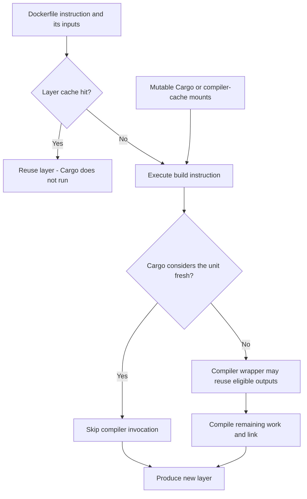

# Rust container builds

**Status: source-backed strategies, not benchmarked here.** This page owns the distinction between Docker layers, dependency recipes, BuildKit cache mounts, and persistent builders. It applies when Cargo runs inside an image build; use the [strategy map](README.md) for direct runner builds and [provider profiles](../providers/README.md) for hosted or self-hosted implementations.

In-scope implementations invoke open-source Docker/BuildKit, cargo-chef, and compiler-cache components from GitHub Actions. Hosted builders and Earthly-specific examples below remain reference material unless their implementation is independently usable within that scope.

## Cache layers in a container build

An exported layer cache and a mutable cache mount contain different state. A hit can skip a `RUN` instruction entirely; after an input change forces that instruction to run, it may need Cargo inputs or compiler artifacts that were never exported with the layers. Docker documents this separation and the extra handling needed for cache mounts with the GitHub Actions backend. ([Docker cache optimization](https://docs.docker.com/build/cache/optimize/), [external backends](https://docs.docker.com/build/cache/backends/), [GitHub Actions cache mounts](https://docs.docker.com/build/ci/github-actions/cache/))

## Strategy choices

| Strategy                              | Use when                                                               | Limitation                                                                                               |
| ------------------------------------- | ---------------------------------------------------------------------- | -------------------------------------------------------------------------------------------------------- |
| Order layers and narrow build context | Tool/dependency inputs change less often than application source.      | A changed input invalidates affected downstream instructions.                                            |
| `cargo-chef` dependency recipe        | Reuse a dependency build layer while application source changes.       | Recipe, compiler, build mode, and paths must match; it is not a universal Cargo action cache.            |
| BuildKit cache mounts                 | A rerun should reuse downloaded dependencies or compiler/target state. | Mounts need persistence or explicit transfer; a layer-cache export alone is insufficient.                |
| Compiler wrapper inside the build     | Eligible compile results should survive source/layer invalidation.     | Wire the wrapper, backend access, and lifecycle inside the build environment.                            |
| Persistent local or remote builder    | Keep layers and mounts near the compute that uses them.                | Builder affinity, concurrent jobs, retention, availability, and publication become operational concerns. |

The [cargo-chef tool profile](../tools/cargo-chef.md) routes its recipe, toolchain, and work-directory requirements to the [upstream README](https://github.com/LukeMathWalker/cargo-chef). Keep recipe generation and dependency cooking consistent with the real build; an invalidated recipe can trigger substantial compilation.

## Provider and article routes

- [Earthly](../providers/earthly.md): separate articles on persistent BuildKit Rust builds, sccache, and cargo-chef.
- [Depot](../providers/depot.md): Rust Dockerfile practices, persistent remote builders, and a separate compiler-cache service.
- [Blacksmith](../providers/blacksmith.md): persistent builder storage and an article examining layers versus mutable mounts.
- [RunsOn](../providers/runs-on.md): sticky BuildKit state backed by managed EBS snapshots.

## Qualification

Compare an unchanged image build, an application-only edit, a dependency edit, and a cold/replaced builder. Keep compiler, target platform, build arguments, and resources fixed; separate image pull/push, cache transfer, compilation, and builder startup. A cached Docker layer that skips Cargo cannot be compared directly with a compiler-cache run that invokes Cargo. Avoid putting registry or cloud credentials in layers or persisted mounts; follow the [persistent-state ownership rules](persistent-state.md#operational-requirements).
