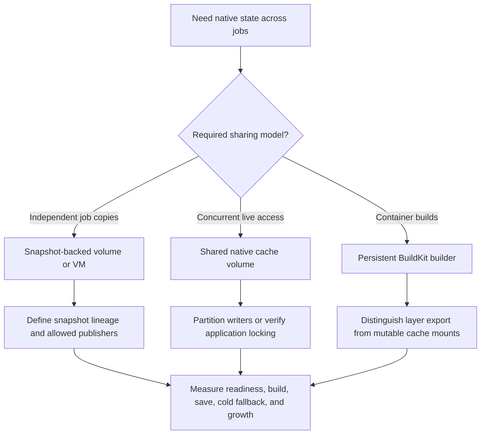

# Persistent Cargo and compiler-cache state

This page owns the provider-neutral choice between native cache volumes, filesystem/VM snapshots, and persistent builders. Provider implementations and their blog posts live in [Providers](../providers/README.md); RunsOn configuration lives in its [deployment map](../deployments/runs-on/README.md). These mechanisms avoid some archive work but are not interchangeable.

## Choose what survives

| Persisted state                            | What it can save                                                          | What it does not establish                                                 |
| ------------------------------------------ | ------------------------------------------------------------------------- | -------------------------------------------------------------------------- |
| Cargo registry and Git inputs              | Dependency downloads and extraction.                                      | Reuse of compiled target artifacts.                                        |
| A compiler cache's local store             | Eligible compilation and some remote object operations.                   | Cargo `Fresh`, complete remote publication, or safe simultaneous writers.  |
| Cargo target state                         | Compilation, linking, and build-script work when Cargo accepts freshness. | Consistent source mtimes, paths, or build context after checkout.          |
| Workspace, Cargo home, and target together | More of the state needed for local no-op fidelity.                        | Correct checkout behavior, credential cleanup, or a current toolchain.     |
| BuildKit state                             | Container layers and mutable cache mounts on the same builder.            | Persistence when moving to a different builder without the relevant state. |

## Choose the persistence mechanism

RunsOn and Blacksmith sticky disks use per-job snapshot-derived volumes; their publication policies differ. WarpBuild snapshot runners capture a broader VM disk. Depot's linked cache-mount documentation describes concurrent live filesystems in **Depot CI beta**, so do not transplant its contract to every GitHub Actions runner. Namespace documents native cache volumes and a separate compiler-cache service. The [provider profiles](../providers/README.md) own these dated source claims.

For RunsOn EBS specifically, begin with [managed sticky disks](../deployments/runs-on/README.md#sticky-disk-options). The [custom EBS snapshot implementation](ebs-snapshot.md) is archived evidence with a different lifecycle owner. For container workloads, continue to [container builds](container-builds.md).

## Operational requirements

Give each path one owner, following [Cargo path coverage](../concepts/cargo-path-coverage.md#compatibility-rule-canonical). Do not let an archive action prune a target directory that a native-state approach is preserving. Separate mutable Cargo target state from immutable compiler-cache objects when they need different concurrency rules.

Define identity by repository/trust domain and compatible build context, choose authorized publishers, and test reader/writer races. A writable isolated clone is different from permission to publish the next snapshot. For a shared live mount, snapshot-style last-writer reasoning is insufficient: concurrent application writes need their own locking or partitioning.

Keep credentials out of persisted paths. Bound bytes and inodes, account for cache reset/expiry, and verify behavior for failed builds, cancellation, lost runners, mount failures, and unavailable caches. Treat the cache as disposable and include a cold recovery run. Use the [measurement procedure](../operations/measuring-cache-performance.md) for complete-job comparisons.

## Evidence and limitations

Only the [archived custom snapshot comparison](../evidence/rust-cache-vs-snapshot.md) establishes this archive's measured EBS no-op result. It does not benchmark managed sticky disks, all providers, or persistent builders. Preserving `target/` without a compatible worktree can still rebuild; consult the [Cargo freshness model](../concepts/cargo-freshness-model.md). Native storage also does not imply that a network filesystem is suitable for Cargo's metadata-heavy workload; see the [S3 Files result](s3-files.md).
