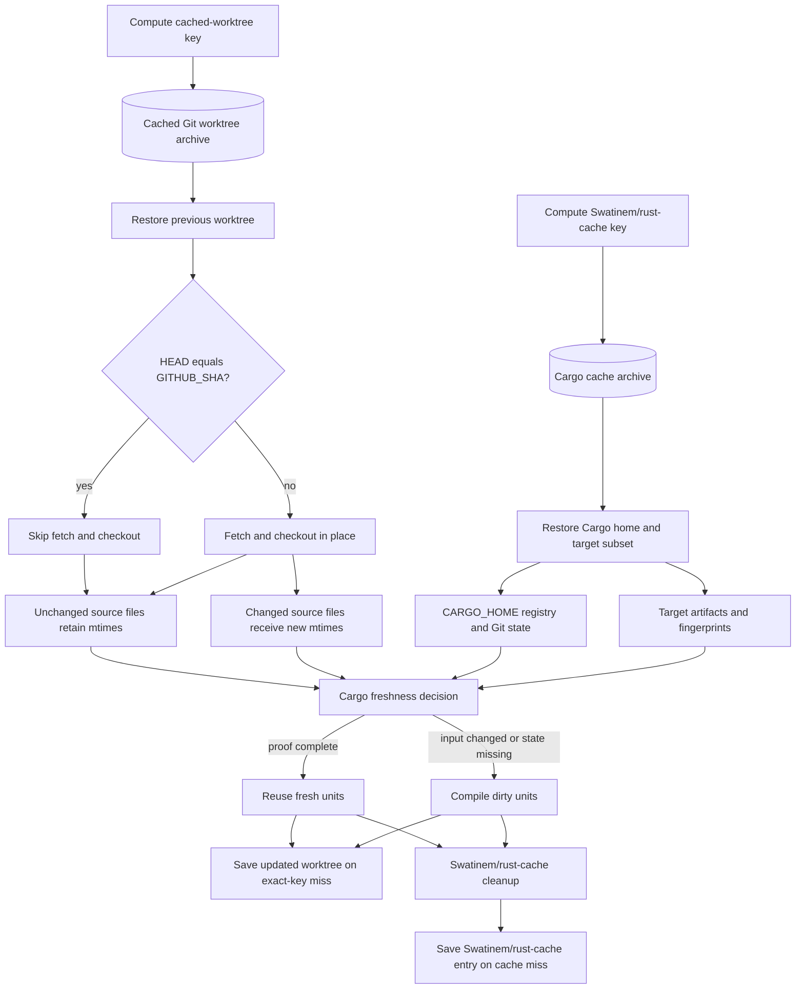

# `Swatinem/rust-cache` With Mtime-Preserving Checkout

## Summary

| Field         | Value                                                                                                                               |
| ------------- | ----------------------------------------------------------------------------------------------------------------------------------- |
| Status        | Conditional narrow target-archive option                                                                                            |
| Use when      | A stable workload reruns the same source state, the archive remains small, and measured restore/save is cheaper than recompilation. |
| Main tradeoff | Full-tree archive extraction/compression and imperfect cleanup can erase the benefit as target state grows.                         |

## Related Files

| File                                                                                 | Purpose                                                                                            |
| ------------------------------------------------------------------------------------ | -------------------------------------------------------------------------------------------------- |
| [Workflow example](../../examples/workflows/rust-cache-mtime-checkout.yml)           | End-to-end workflow using a cached worktree with `Swatinem/rust-cache`.                            |
| [Cached worktree action](../../examples/actions/cached-worktree-checkout/action.yml) | Composite action that checks out into a restored worktree without rewriting unchanged file mtimes. |

## Design

```text
actions/cache restores cached worktree for the same source state
custom checkout checks out source in place and preserves unchanged mtimes
Swatinem/rust-cache restores Cargo home and target state
Cargo builds with explicit CARGO_TARGET_DIR
```

## Architecture

The source-worktree cache and `Swatinem/rust-cache` preserve different inputs to Cargo's freshness decision:



The cached worktree prevents unchanged source files from appearing newer than restored outputs. `Swatinem/rust-cache` independently restores Cargo home and a dependency-oriented target subset. Both are needed for this approach: stable source mtimes do not replace target fingerprints, and restored target state does not help if checkout rewrites every source mtime.

For the RunsOn archive backend, see the [RunsOn guide](../deployments/runs-on/README.md). This page keeps the approach itself provider-neutral.

## Why It Works

Normal checkout rewrites source mtimes. Cargo can treat rewritten source files as newer than restored target fingerprints, so local workspace crates rebuild even if contents are unchanged.

The cached worktree checkout avoids that false invalidation:

- If the worktree is already at `GITHUB_SHA`, it skips checkout entirely.
- If the worktree is older, Git checks out the new commit in place.
- Git rewrites changed files only, so unchanged files keep stable mtimes.

`Swatinem/rust-cache` then handles Cargo home and dependency-oriented target state.

## Worktree Hygiene

The supplied cached-worktree action uses `git checkout --detach --force`, but it does not run `git clean`. Checkout overwrites tracked paths; untracked or generated files can survive inside the persisted worktree across source states.

Keep build outputs and other mutable caches outside the cached source worktree. If a workload requires clean untracked state, add a reviewed cleanup policy after checkout, such as `git clean -fd`; add `-x` only when deleting ignored files is intentional and safe. Never persist credentials or other secrets in the worktree cache.

## Recommended Settings

```yaml
- uses: Swatinem/rust-cache@v2
  with:
    workspaces: ./app -> ../../target-for-job
    cache-targets: true
    cache-workspace-crates: true
    cache-bin: false
    # Put source identity in the restore lineage so another commit's target
    # cannot be prefix-restored and copied forward.
    shared-key: app-target-v2-${{ github.sha }}
    save-if: ${{ github.event_name == 'push' && github.ref == 'refs/heads/main' }}
```

These settings control different parts of the action's restore and cleanup behavior. See [`Swatinem/rust-cache` Behavior](../concepts/rust-cache-behavior.md) for exact true/false behavior, workspace/path-dependency examples, cleanup details, and upstream source links.

- `cache-targets: true` includes the configured target directory; this is the upstream default and is explicit here because target state is part of the approach.
- `cache-workspace-crates: true` retains matching target artifacts for Cargo workspace members, including libraries declared as workspace members.
- Leave `cache-all-crates` at its `false` default unless another step downloads registry crates outside the current dependency graph, such as a tool built through `cargo install` or an install action's source-build fallback.
- Keep setup tools outside this archive unless Cargo-installed binaries are a deliberate measured part of it.
- Use one trusted canonical writer. PR jobs should normally restore without saving.

The options still do not produce a complete target snapshot, and exact cache hits are not replaced in the post step.

Use a stable explicit target directory:

```yaml
env:
  CARGO_TARGET_DIR: /tmp/cargo-target-one-job
```

## Archive Guardrails

Do not use a broad restore lineage that crosses source, lockfile, profile, feature, target, compiler-wrapper, or build-command changes. The upstream action always has a fallback restore key, so include the relevant identity in `shared-key` or `prefix-key` when exact-only behavior is required.

For every target archive:

- Record compressed bytes, uncompressed target bytes, file count, restore time, save time, and exact/partial hit state.
- Establish the initial healthy size as `B`, warn near `1.5 × B`, and stop or reset the experiment near `2 × B` unless measured evidence justifies the change.
- Disable target caching when restore and save approach the cost of a clean build or become a material fraction of job time.
- Use backend lifecycle expiry for old immutable objects, but do not mistake object retention for pruning inside the active archive.
- Rotate a namespace only as an explicit reset; rotation does not prevent the new lineage from growing again.

## Strengths

- Maintained upstream cache action.
- Can produce a warm Cargo no-op for repeated runs of the same stable source state.
- Mtime-preserving checkout avoids invalidating otherwise consistent restored target metadata.
- Avoids network filesystem metadata latency.

## Limitations

- Restores and saves a filesystem archive rather than compiler objects.
- Cleanup is not byte-bounded or generation-aware.
- Prefix-restoring an older target after a key change can copy old artifact generations into the next immutable object.
- `rust-cache` target keys intentionally do not include workspace source contents.
- Exact cache hits can restore stale workspace artifacts and then skip saving rebuilt target state.
- Affected local path workspace members can therefore rebuild repeatedly in some jobs.
- The sample checkout preserves untracked and ignored files unless the workflow adds an explicit cleanup policy.
- Every immutable source lineage consumes storage until backend expiration.

## Related Alternatives

Related source-mtime approaches, Retimer evidence, and Cargo checksum-freshness notes are preserved in [Source Mtime Alternatives](../reference/source-mtime-alternatives.md). They mainly address checkout mtime churn; they do not fix `rust-cache` exact-hit behavior where stale workspace target state is restored and not saved because the target key ignores workspace source contents.

## Evidence

The [cached worktree and source-keyed target-cache evidence](../evidence/cached-worktree-and-target-cache.md) records the normal-checkout failure, warm Cargo no-op behavior, and remaining stale exact-hit outliers. The [target archive growth evidence](../evidence/target-archive-growth.md) records how an initially useful archive became net harmful after copy-forward growth.

## Decision

Use this only when all of the following hold:

- The workload is narrow and stable.
- Exact source/build-state lineage is acceptable.
- The archive is small and monitored.
- Restore and save remain cheaper than clean compilation.
- A clean target with optional [`sccache`](../tools/sccache.md) has been measured and is not the better fit.
