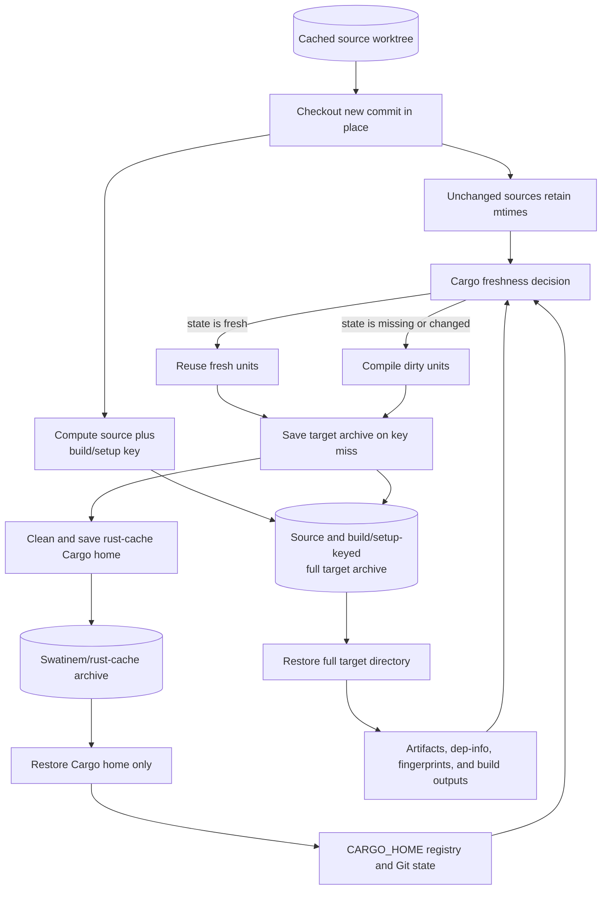

# `Swatinem/rust-cache` With Source-Keyed Target Cache

## Summary

| Field         | Value                                                                                                                                                        |
| ------------- | ------------------------------------------------------------------------------------------------------------------------------------------------------------ |
| Status        | Narrow exception; freshness behavior proven, growth safety requires separate measurement                                                                     |
| Use when      | Affected local path workspace members repeatedly rebuild, repeated identical-source runs matter, and a small exact source-keyed target archive is justified. |
| Main tradeoff | Full-target serialization, strict restore ordering, broad source invalidation, and immutable-object storage.                                                 |

## Related Files

| File                                                                                  | Purpose                                                                               |
| ------------------------------------------------------------------------------------- | ------------------------------------------------------------------------------------- |
| [Workflow example](../../examples/workflows/rust-cache-source-keyed-target-cache.yml) | Splits Cargo home and source-keyed target caching with the required restore ordering. |

## Problem It Solves

`Swatinem/rust-cache` target caching can restore an exact cache key even when local workspace source has changed, because its target cache key focuses on Rust/Cargo environment, lockfiles, manifests, and config. With `cache-workspace-crates: true`, this can still leave a stale exact target cache for some workspace artifacts.

When the restored key is exact, `rust-cache` reports `Cache up-to-date` in its post step and does not save the rebuilt target state. The next run can restore the same stale target state and rebuild the same local crates again.

## Design

```text
cached worktree checkout preserves unchanged source mtimes
Swatinem/rust-cache restores Cargo home only with cache-targets: false
actions/cache restores full target directory after rust-cache
target cache key and restore lineage include source state
Cargo builds with explicit CARGO_TARGET_DIR
```

## Architecture



The full target archive restores after `rust-cache`, so `rust-cache` cannot prune workspace artifacts from it before the build. Its key and fallback lineage include source state, so another source version's target tree is not restored and copied into the new object.

## Critical Ordering

The target cache must restore after `rust-cache`.

Correct:

```text
restore source worktree
setup Cargo registry credentials
setup toolchain
rust-cache restore Cargo home only
restore full target directory with actions/cache
build
actions/cache saves target directory
rust-cache post cleanup runs after target cache save
```

Incorrect:

```text
restore target directory with actions/cache
rust-cache restore
build
```

The incorrect ordering allowed `rust-cache` target cleanup to remove workspace target artifacts before they could prove Cargo units fresh.

## Key Strategy

The final workaround used a fast Git source key combined with the exact compiler identity:

```bash
hash="$({
  git rev-parse HEAD:app
  git ls-files -s app
  rustc -Vv
} | sha256sum | cut -d ' ' -f1)"
```

Tradeoff:

- Any tracked change under `app` invalidates all per-job target caches for that source hash.
- A change to the resolved compiler invalidates the target cache even when a moving toolchain channel such as `stable` is used.
- The computation is fast and simple.
- The safe current shape does not use a broad fallback across source hashes. A changed source state starts clean.

An intermediate dependency-closure key using `cargo metadata` was more precise, but it added about a minute per job in CI and was too expensive.

The key should also include a small manual namespace for build-command semantics not represented by the source and compiler hash:

```yaml
target-key: locked-v1-${{ steps.target-key.outputs.hash }}
```

Increment the namespace when changing build flags, target triples, Cargo features, profiles, compiler wrappers, setup backends, toolchain locations, cached target directories, or other options that can affect Cargo fingerprints. The `rustc -Vv` input covers the resolved compiler version and host, but not every build/setup choice. If the command or setup shape changes but the target key does not, Cargo may rebuild against an exact target-cache hit and the cache action will correctly skip saving because the key was exact.

Do not use a restore prefix that omits the source/build namespace. That historical shape can restore an older complete target tree, add another artifact generation, and save the combined tree under a new immutable key. Source keying fixes stale exact-hit freshness only when the restore lineage is equally strict.

The repeated outliers this fixed were local path workspace members in generated-code/build-script chains. Tight `cargo:rerun-if-changed` hints are still good build-script hygiene, but they do not fix stale exact target-cache restores when the target cache key ignores workspace source state.

## Cargo Flag Notes

Use `--locked` for CI artifact builds. It ensures `Cargo.lock` is up to date and prevents dependency resolution drift. It does not imply offline mode, so Cargo may still print `Updating crates.io index` even when no compilation happens.

Do not assume `--frozen` or `--offline` will work with `rust-cache`. Those modes require complete local registry/index state. `rust-cache` intentionally prunes Cargo home to keep archives small, which can make offline registry operations fail even when normal cached builds are fast and correct.

## Strengths

- Produces true Cargo no-op behavior for the tested generated-code and build-script outliers.
- Keys complete target state by source and build semantics.
- Keeps Cargo-home dependency caching under maintained `rust-cache` behavior.

## Native Target-Key Prototype

A native `target-key` prototype in a local `rust-cache` fork was also tested against the same workload. It removed the separate `actions/cache` target step by making `rust-cache` split Cargo home and target caches internally. After one seed run, repeated runs restored exact Cargo and target cache hits across tested binary and UI jobs. Cargo produced no `Compiling` lines; remaining build phases were around 0.3 seconds.

This validates the native action design, but the copyable workaround in this page remains the maintained archive example until upstream `Swatinem/rust-cache` releases equivalent support.

## Limitations

The workaround adds custom cache composition, target-archive cost, and ordering constraints. Its Cargo freshness behavior is proven, but its archive economics must be measured for each workload.

- Any tracked source change under the selected tree invalidates the per-job target key.
- Restore ordering is mandatory.
- The current copyable implementation needs a second cache action.
- Changed source states compile from a clean target when broad fallback is disabled.
- Repeated source states still extract and may save the complete target archive.
- Immutable target objects consume storage until backend lifecycle expiry.
- Cleanup and size limits are external operational responsibilities.

## Evidence

The [cached worktree and source-keyed target-cache evidence](../evidence/cached-worktree-and-target-cache.md) records the exact-hit cycle, ordering tests, measured no-op results, native `target-key` prototype, and key-namespace lesson. The [target archive growth evidence](../evidence/target-archive-growth.md) explains why source-keyed archives still need exact restore lineages and size guardrails, and the [cache strategy benchmarks](../evidence/cache-strategy-benchmarks.md) supply the end-to-end comparison against clean targets.

## Decision

Use this workaround if:

- Affected local path workspace members repeatedly rebuild on exact `rust-cache` hits.
- Those rebuilds are expensive enough to justify custom cache composition.
- Repeated runs of the same source state are common enough to pay for full archive restore.
- The archive remains small, exact-keyed, and monitored.

Do not use it as a general PR cache with a broad source-independent restore prefix. Retire or simplify it if upstream `rust-cache` adds equivalent source-keyed target caching, or if clean `target/` with [`sccache`](../tools/sccache.md) wins the end-to-end comparison.
