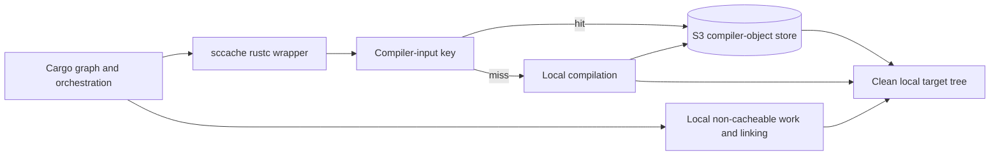

# S3-Backed `sccache`

## Summary

| Field | Value |
| --- | --- |
| Status | Leading PR-CI candidate; adoption requires a representative canary |
| Use when | Jobs start with a clean target, source changes frequently, and eligible compiler outputs are reusable across commits. |
| Main tradeoff | Cargo orchestration, per-object remote operations, non-cacheable calls, build scripts, and final linking still run on every job. |

## Related Files

| File | Purpose |
| --- | --- |
| [RunsOn `sccache` canary workflow](../../examples/workflows/runs-on-sccache-canary.yml) | Generic trusted-writer canary without a separate Cargo-input archive and with compiler-cache statistics. |
| [Mr. Boxington comparison](mr-boxington.md) | Experimental alternative with separate local and fresh-runner evidence. |
| [RunsOn research](../research/runs-on-sccache/README.md) | Proposed lifecycle, transport, persistence, and performance work; not current features. |
| [RunsOn deployment](../deployments/runs-on/README.md) | Direct S3 configuration, namespace, IAM, and runner-specific notes. |
| [Rust CI cache ecosystem sources](../reference/vendor-ci-cache-sources.md) | External direct-object, near-cache-service, colocated archive-cache, persistent-runner, and compiler-wrapper designs. |

## Design

`sccache` caches eligible compiler invocations rather than a complete Cargo target tree:

```text
Cargo requests a rustc invocation
  sccache hashes compiler, source, flags, features, and relevant inputs
    hit  -> fetch and materialize that invocation's outputs
    miss -> compile locally and store the new outputs
Cargo continues orchestration and linking on the runner
```



Old compiler objects can remain in S3 until lifecycle expiry without being downloaded into every job. A lockfile, feature, compiler, or flag change creates different object keys instead of copying a previous target archive into a new one.

## Required Configuration Principles

- Set `CARGO_INCREMENTAL=0`; `sccache` and rustc incremental compilation are not compatible.
- Keep `target/` disposable and on fast local storage.
- Use a repository-, platform-, and schema-specific S3 prefix.
- Install `sccache`; enabling a backend does not install the executable.
- Print `sccache --show-stats` even when the build fails.
- Keep Cargo registry/Git input caching as a separate measured choice.
- Confirm object lifecycle, request cost, namespace growth, and error handling.

For RunsOn, `runs-on/action@v2` can configure its S3 backend with:

```yaml
- uses: runs-on/action@v2
  with:
    sccache: s3
```

The action exports the S3 backend environment and `RUSTC_WRAPPER=sccache`; a separate installer such as `Mozilla-Actions/sccache-action` is still required. A later `SCCACHE_S3_KEY_PREFIX` step overrides only the stack-wide default namespace rather than configuring a second backend. See the canonical [RunsOn deployment map](../deployments/runs-on/README.md#direct-s3-sccache) for the exact variables and workflow shape.

## Trust And Isolation

Direct S3 `sccache` traffic does not inherit Magic Cache protocol isolation automatically.

- Let only trusted canonical jobs write compiler objects.
- Give untrusted PR jobs a read-only IAM role or a separate trusted boundary before allowing them to read the shared namespace.
- `SCCACHE_S3_RW_MODE=READ_ONLY` limits `sccache` itself, but it does not prevent arbitrary workflow code from using broader S3 permissions attached to the runner.
- Use a dedicated bucket or narrowly scoped prefix policy when untrusted code can execute.

The writer policy must be enforced by IAM or an equivalent infrastructure boundary, not only by a workflow condition.

## What It Reuses

Current upstream Rust support caches crate outputs that do not invoke the system linker, including common `rlib`, `staticlib`, and metadata compilation. Outputs that invoke linking, such as binaries, procedural macros, `cdylib`, and `dylib`, are not cached in the same way.

Even a perfect cacheable hit rate leaves:

- Cargo dependency-graph traversal.
- Build-script execution and related orchestration.
- Procedural-macro and other linker-invoking outputs.
- Individual remote object lookups, downloads, decompression, and writes.
- Final linking and unsupported outputs.
- Creation of a fresh target tree.

## Strengths

- Reuses compiler work without restoring a complete historical target archive.
- Misses and invalidation occur per compiler invocation instead of per monolithic target tree.
- Avoids full-target tar/zstd extraction and recompression.
- Supports reuse across source changes when unaffected compiler inputs remain identical.
- Exposes hits, misses, non-cacheable calls, errors, and cache size statistics.

## Limitations

- High hit rate can still have modest absolute value on short builds.
- Thousands of small remote operations can create a latency floor.
- Build scripts, linking, and unsupported crate types remain local.
- Warm-cache and cold-population behavior differ.
- Direct object storage needs lifecycle, IAM, namespace, monitoring, and cost ownership.
- A compiler-cache outage or wrapper failure needs a tested rollback to direct rustc execution.

## Evidence

The [cache-strategy benchmarks](../evidence/cache-strategy-benchmarks.md) record the strong default-server warm result, cold-population regression, input-archive ablation, slower client-side modes, and incomplete multilevel writes. The read-only control shows that successful uploads were not the sole cold penalty; wrapper, hashing, remote lookup, compiler interaction, and run variance were not isolated. The [Mr. Boxington comparison](../evidence/mr-boxington-vs-sccache.md) adds separate local and containerized fresh-runner observations. Use those pages for timings and limitations.

## Decision

Use S3-backed `sccache` in default server mode as the leading canary for changing PR workloads after establishing the clean-target baseline. Do not combine it with a separate input-only Cargo archive by default. The two mechanisms own different data, but the measured combination added no compiler-cache reuse benefit and was directionally slower; add Cargo-input caching only when separately measured registry or Git download savings exceed its archive and action overhead. Do not enable client-side or multilevel modes based only on upstream architecture claims; the measured direct-S3 client path was substantially slower despite a high hit rate, and background multilevel writes were incomplete at teardown. Adoption still requires representative source, lockfile, cold, warm, and concurrent scenarios plus IAM-enforced trust separation, lifecycle ownership, cost checks, and a direct-rustc rollback. Do not adopt any mode from hit rate alone.

## Upstream References

- [`sccache` Rust support and limitations](https://github.com/mozilla/sccache/blob/main/docs/Rust.md)
- [`sccache` S3 backend](https://github.com/mozilla/sccache/blob/main/docs/S3.md)
- [`Mozilla-Actions/sccache-action`](https://github.com/Mozilla-Actions/sccache-action)
- [RunsOn `sccache` example](https://github.com/runs-on/action#sccache)
