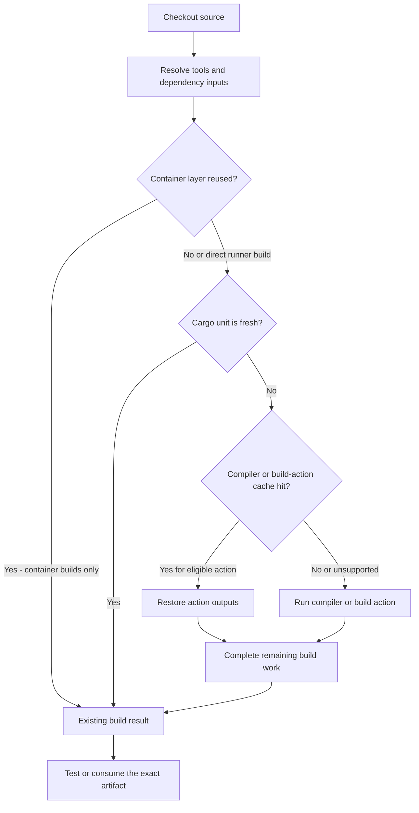

# Where CI reuse happens

This page explains which kinds of work different caches avoid. Use the [decision flow and strategy map](../approaches/README.md) to choose an experiment, and [Providers](../providers/README.md) to map the mechanism to a service.

Tool caches, dependency archives, and Git mirrors reduce preparation work before the build. A container layer may skip an entire instruction. Cargo's own target state may let it skip a build unit. A compiler wrapper is consulted only when Cargo invokes the wrapped compiler; a hit can still leave orchestration, build scripts, unsupported calls, and linking. The tool's coverage determines which of those are reusable. See [Cargo freshness](cargo-freshness-model.md) and the [compiler-cache comparison](../tools/compiler-caches.md).

The [storage topology map](storage-topologies.md) owns the S3/GHA, EBS, NVMe, tmpfs, and file-service distinctions. Storage is another axis: archives serialize selected paths; object caches transfer keyed results; native disks preserve selected filesystem state; snapshots clone a filesystem or VM image. “S3-backed” describes a backend, so it cannot tell you whether the client is moving a target archive or thousands of compiler objects. Likewise, remote caching reuses prior results; remote execution moves computation to another worker.

Some layers combine usefully: cached tool setup with clean-target compiler reuse, or a persistent builder with dependency layers and cache mounts. Give every mutable path one owner and qualify any wrapper composition. A provider's archive-cache integration does not automatically redirect a wrapper's separate S3 or WebDAV client. The [path ownership rule](cargo-path-coverage.md#compatibility-rule-canonical) and [provider profiles](../providers/README.md) define those boundaries.
