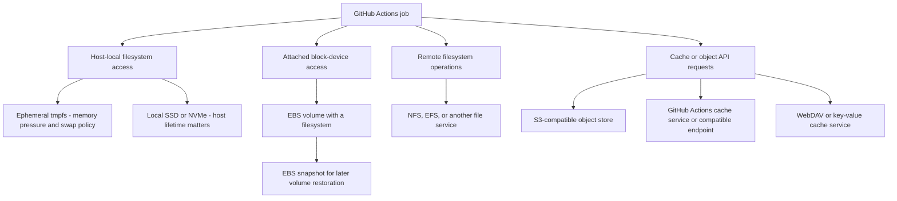

# Storage topologies for CI caches

This page owns the mapping between cache strategies and storage. [Tools](../tools/README.md) identify implementations, [approaches](../approaches/README.md) identify reusable work, and [providers](../providers/README.md) identify deployments and source claims. Storage location, access protocol, persisted payload, and lifetime are separate axes.

## Where bytes live and how the job reaches them

EBS is network-attached **block storage**: the guest mounts a filesystem on a volume. NFS/EFS is a network **filesystem** serving file operations. S3 is an **object API**; putting archives there or mounting a filesystem facade over it are different strategies. The GitHub Actions cache service is a managed cache API, not a user-selected S3 bucket. These distinctions follow the [AWS storage overview](https://docs.aws.amazon.com/AWSEC2/latest/UserGuide/Storage.html), [EBS documentation](https://docs.aws.amazon.com/ebs/latest/userguide/what-is-ebs.html), and [GitHub cache model](https://docs.github.com/en/actions/concepts/workflows-and-actions/dependency-caching).

On EC2 Nitro, EBS volumes are also exposed through NVMe devices. A `/dev/nvme...` name therefore does not prove host-local SSD storage; identify the actual volume/device backing the path. ([EBS and NVMe](https://docs.aws.amazon.com/ebs/latest/userguide/nvme-ebs-volumes.html))

## Storage properties

| Storage or interface                  | Survives a job?                                                                                                 | Relevant CI tradeoff                                                                                          |
| ------------------------------------- | --------------------------------------------------------------------------------------------------------------- | ------------------------------------------------------------------------------------------------------------- |
| tmpfs                                 | No automatic cross-job persistence; contents disappear when its mount/container lifetime ends.                  | Uses memory needed by compilation; limit capacity and measure OOM/swap behavior.                              |
| Host-local SSD/NVMe                   | Only if the host and relevant state are deliberately retained. Instance-store lifetime is tied to the instance. | Fast local state does not guarantee scheduling the next job on the same host.                                 |
| EBS volume                            | Can outlive an instance; actual deletion policy and reattachment decide reuse.                                  | Provisioned I/O, attach/mount readiness, placement, and filesystem lifecycle matter.                          |
| EBS snapshot restored to a new volume | Snapshot persists independently; each job can receive a new volume.                                             | Native state without tar, but snapshot selection, initialization, publication, and retention still cost time. |
| S3 or compatible object storage       | Independent of the runner, subject to store lifecycle.                                                          | Object count, request latency, transfer, compression, and client publication semantics matter.                |
| GHA cache API                         | Independent of the runner, subject to service scope/retention/eviction.                                         | Client format and cache service semantics apply; an action archive hit is not a compiler hit.                 |
| Shared network filesystem             | Independent of a job if the service persists it.                                                                | Metadata latency, permissions, locking, and concurrent writers can dominate.                                  |
| WebDAV/Redis/other cache service      | Depends on the service's storage, eviction, and durability contract.                                            | Protocol and backing media are separate; “near runner” is a placement claim to verify.                        |

AWS documents the EBS, snapshot, and instance-store lifetime distinctions in its [storage overview](https://docs.aws.amazon.com/AWSEC2/latest/UserGuide/Storage.html). Docker's [tmpfs documentation](https://docs.docker.com/engine/storage/tmpfs/) explains mount lifetime, memory limits, and possible swap-backed writes; do not assume “tmpfs” guarantees that bytes never reach disk. Other performance and lifecycle entries above are experiment-design implications, not provider benchmarks.

## Map a strategy onto storage

| Strategy or tool                     | Working state in the job                                               | Cross-job storage or transfer                                                          | Key boundary                                                                                        |
| ------------------------------------ | ---------------------------------------------------------------------- | -------------------------------------------------------------------------------------- | --------------------------------------------------------------------------------------------------- |
| Clean target / no Rust cache         | Ephemeral local filesystem; optionally a measured tmpfs target.        | None for Rust build state.                                                             | tmpfs or NVMe changes execution cost, not reuse.                                                    |
| Input-only rust-cache                | Restored Cargo inputs on a local filesystem.                           | Archive in GHA or a compatible/provider object backend.                                | Downloads are reused; target compilation is not.                                                    |
| Whole-target archive                 | Extracted target/fingerprints on a local filesystem.                   | Serialized archive in GHA/S3-compatible transport.                                     | Restored source and target must satisfy Cargo freshness.                                            |
| sccache with direct S3 or GHA        | Local output paths and wrapper/server state.                           | Eligible compiler objects through the selected S3 or GHA client.                       | These object clients differ from `actions/cache` archiving a whole directory.                       |
| sccache local or multilevel          | Local disk store, optionally a persistent/sticky mount.                | None, or another configured backend such as S3/WebDAV.                                 | A durable L0 does not prove background remote writes completed.                                     |
| Mr. Boxington                        | Local action objects; target state when that payload mode is selected. | Selected GitHub payload or supported remote/server transport.                          | Record `objects` versus `target` instead of calling both compiler caching.                          |
| Kache                                | Local content store on a compatible filesystem.                        | Optional local-store archive, direct S3, or filesystem remote for supported artifacts. | Untested here; local C/C++ support does not imply remote sharing.                                   |
| RunsOn managed sticky Cargo paths    | Filesystem on a per-job EBS volume.                                    | Provider-managed EBS snapshot lineage.                                                 | Built-in Cargo inputs and custom target persistence differ.                                         |
| Custom EBS snapshot action           | Workspace/Cargo/target subtree on mounted EBS.                         | Workflow-managed snapshots.                                                            | Archived lifecycle implementation, distinct from managed sticky disks.                              |
| Provider native disk / VM snapshot   | Selected mounted paths or a broader VM filesystem.                     | Provider-specific clone or shared-live-volume mechanism.                               | Consult the profile; “sticky” does not define one universal contract.                               |
| cargo-chef / Docker layer cache      | Builder layer state on its host storage.                               | Persistent builder or supported layer-cache export/import.                             | cargo-chef does not choose the physical storage medium.                                             |
| BuildKit mutable cache mount         | Directory in builder-managed storage.                                  | Retained builder disk or an explicit compatible transfer mechanism.                    | Exporting layer cache alone does not preserve these mutable mounts.                                 |
| Network-filesystem target experiment | Cargo paths reached through file-service operations.                   | Remote filesystem/service.                                                             | [S3 Files](../approaches/s3-files.md) was rejected for the measured metadata-heavy target workload. |
| Exact artifact fan-out               | Downloaded build output at the consumer.                               | Workflow artifact service or explicitly designed artifact store.                       | Reuse an identified producer result, not an opportunistic Cargo cache key.                          |

Tool support is sourced in the [tool profiles](../tools/README.md), native-state contracts in [persistent state](../approaches/persistent-state.md), and vendor placement in [provider profiles](../providers/README.md). GHA and S3 appearing in the same row do not imply matching protocols, permissions, or write semantics. A mounted path named `cache` does not establish which physical device backs it.

## Record a concrete topology

For each experiment, identify the working paths and their actual backing filesystem/device, selected client/API, remote region or placement, retained payload, lifecycle owner, and who can publish. Record cold-start behavior, bytes/inodes, I/O and memory pressure, transfer costs, and post-job publication. Use the existing [measurement procedure](../operations/measuring-cache-performance.md) and [record schema](../reference/cache-measurement-schema.md); do not create a separate incompatible measurement format.

For example, “ephemeral local target with sccache using S3 objects” and “native target on EBS restored from a snapshot” are two distinct experiments even when both run on RunsOn. “tmpfs target with remote compiler objects” combines ephemeral working storage with persistent cached outputs. Neither topology alone guarantees a speedup.
