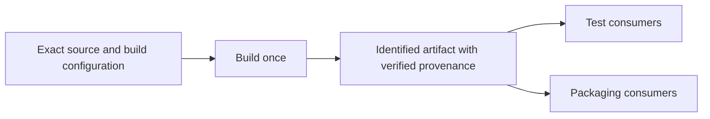

# Reduce repeated CI work

This page owns optimizations adjacent to Cargo caching: tool preparation, checkout transfer, artifact fan-out, and avoiding unnecessary execution. Use the [strategy map](../approaches/README.md) to place them alongside compiler and filesystem caches. The configurations below are design choices to measure, not new benchmark results.

## Preparation and checkout

Cache stable tool downloads with [mise](mise-tool-setup.md), or use a versioned prebuilt runner/container image when the provider supports it. Account for image creation, patching, pull/boot cost, and toolchain identity; an old baked compiler can create a misleading hit or incompatible output. [Container dependency layers](../approaches/container-builds.md) and [WarpBuild VM snapshots](../providers/warpbuild.md) are different ways of moving preparation before a job.

Git mirrors and cached Git objects reduce network transfer for large repositories. The [RunsOn](../providers/runs-on.md) and [Actuated](../providers/actuated.md) sources document examples. They do not by themselves preserve the checked-out files' mtimes. When targeting Cargo no-op reuse, use the separate [source-mtime guidance](../reference/source-mtime-alternatives.md).

## Build once and pass exact outputs

When several jobs need exactly the same build output, one producer can publish an artifact and dependent jobs can consume it. GitHub documents this with upload/download actions and `needs` ordering. ([Workflow artifact guide](https://docs.github.com/en/actions/tutorials/store-and-share-data))

Identify source revision, target triple, compiler, profile/features, and producer run; verify integrity and the producer's trust before consumption. Transfer runtime libraries or companion files the consumer actually needs. This avoids duplicate compilation for matching consumers; it does not make incompatible matrix jobs share one binary or replace an opportunistic cross-run cache. Include artifact transfer and producer serialization in complete-workflow timing.

## Avoid unnecessary execution and tune remaining work

Use path/job conditions only when they account for all relevant source, manifest, workflow, configuration, and generated-input dependencies. Account for required-check behavior when skipping workflows. GitHub's [workflow syntax](https://docs.github.com/en/actions/reference/workflows-and-actions/workflow-syntax) documents filters, conditions, and concurrency; cancelling superseded runs saves resources but needs compatible cache publication/cleanup behavior.

Once repeated work is removed, measure CPU, memory, local NVMe, filesystem metadata, and parallelism with the [runner measurement procedure](measuring-cache-performance.md). A RAM-backed or faster local target can speed remaining work without preserving anything across jobs. A larger runner or distributed compilation changes compute, rather than establishing a cache hit; the [sccache distributed quickstart](https://github.com/mozilla/sccache/blob/v0.17.0/docs/DistributedQuickstart.md) describes a separate server/scheduler/toolchain deployment that has not been tested here.
