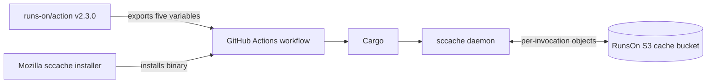

# Compiler-cache implementation reference

Status: Pinned source observations with a release refresh on 2026-09-06. This page owns versioned sccache, OpenDAL, and RunsOn integration behavior. The refresh does not update the versions or outcomes of archived measurements. Use [the sccache approach](../tools/sccache.md) for selection, [RunsOn deployment](../deployments/runs-on/README.md) for configuration, and [research](../research/runs-on-sccache/README.md) for proposed changes.

## Release refresh: 2026-09-06

| Component             | Newer source check                                                                                                                                                                                            | Implication                                                                                                                                                                                         |
| --------------------- | ------------------------------------------------------------------------------------------------------------------------------------------------------------------------------------------------------------- | --------------------------------------------------------------------------------------------------------------------------------------------------------------------------------------------------- |
| RunsOn action         | [v2.3.1 sccache setup](https://github.com/runs-on/action/blob/v2.3.1/internal/sccache/sccache.go) is unchanged from the v2.3.0 file reviewed below.                                                           | It still exports backend/wrapper settings without installing or coordinating the compiler-cache lifecycle. The released caller now enables this helper on Windows as well as Linux.                 |
| RunsOn stack          | [v3.2.3 template](https://github.com/runs-on/runs-on/blob/v3.2.3/cloudformation/template.yaml) is newer than the v3.2.2 design baseline.                                                                      | Recheck actual deployed policies and sticky behavior before adoption; the pinned discussion below describes v3.2.2.                                                                                 |
| sccache               | [v0.17.0 Cargo.lock](https://github.com/mozilla/sccache/blob/v0.17.0/Cargo.lock) still uses OpenDAL 0.55.0.                                                                                                   | New OpenDAL releases do not change the tested binary.                                                                                                                                               |
| OpenDAL GHA           | [v0.59.0 writer](https://github.com/apache/opendal/blob/v0.59.0/core/services/ghac/src/writer.rs) propagates finalization errors; [PR #8136](https://github.com/apache/opendal/pull/8136) is in that release. | The upstream fix exists. Qualifying a sccache build with the fix and verifying RunsOn protocol compatibility remain separate work.                                                                  |
| OpenDAL S3 Express    | [v0.59.0 release](https://github.com/apache/opendal/releases/tag/v0.59.0) includes session-authentication support through [PR #8135](https://github.com/apache/opendal/pull/8135); tracker #8053 is closed.   | Do not describe directory-bucket support as wholly absent upstream. The tested sccache dependency still needs replacement and integration qualification.                                            |
| S3 conditional writes | The [current PutObject API](https://docs.aws.amazon.com/AmazonS3/latest/API/API_PutObject.html) documents `If-None-Match` without the earlier proposal's blanket directory-bucket exclusion.                  | Verify conditional creation in the selected client and directory-bucket operation. An external key coordinator is a fallback if that contract is unavailable, not an unconditional AWS requirement. |

These checks are source review, not a fresh infrastructure deployment or benchmark. See [alternative backend qualification](../research/runs-on-sccache/alternative-backends.md) before changing transports.

## Source And Version Scope

### Pinned Implementations

The implementation claims in this reference use released or explicitly identified revisions rather than movable default branches.

| Component                                                                                                                                   | Revision reviewed                          | Role in this reference                                                                       |
| ------------------------------------------------------------------------------------------------------------------------------------------- | ------------------------------------------ | -------------------------------------------------------------------------------------------- |
| [`runs-on/action` v2.3.0](https://github.com/runs-on/action/tree/46910bf61b41721b0579f237e186afb35477007a)                                  | `46910bf61b41721b0579f237e186afb35477007a` | Action inputs at this revision, exported environment, setup/post lifecycle, and sticky modes |
| [RunsOn v3.2.2](https://github.com/runs-on/runs-on/tree/9fa7739208d5d034e597c550f9bec5e2340225c1)                                           | `9fa7739208d5d034e597c550f9bec5e2340225c1` | Cache bucket, S3 endpoint, IAM, lifecycle, Magic Cache broker, and runner roles              |
| [`sccache` v0.17.0](https://github.com/mozilla/sccache/tree/c037e117c7625a2668633574028a6addf2a96a6e)                                       | `c037e117c7625a2668633574028a6addf2a96a6e` | Backend behavior, multilevel semantics, timeouts, shutdown, and Rust compatibility           |
| [`Mozilla-Actions/sccache-action` v0.0.11](https://github.com/Mozilla-Actions/sccache-action/tree/fc920bf0ec8de6ee65d409111f7ec508035751ba) | `fc920bf0ec8de6ee65d409111f7ec508035751ba` | External installer at this revision and post-run statistics reporter                         |
| [OpenDAL 0.55.0 source used by `sccache` v0.17.0](https://github.com/apache/opendal/tree/48c48b1a1d3821af0864adc878e3864019ee9755)          | `48c48b1a1d3821af0864adc878e3864019ee9755` | Released GHA and remote-storage implementation under the tested `sccache`                    |
| [OpenDAL v0.58.2](https://github.com/apache/opendal/releases/tag/v0.58.2)                                                                   | `5add929a5a4995f0650300dfb818ab510f999d61` | Later released behavior checked for relevant fixes                                           |

[`runs-on/action` PR #57](https://github.com/runs-on/action/pull/57) is useful design input for repository-scoped prefixes, but it was closed without merging on 2026-08-22. It is not released action behavior. Its successor, [PR #58](https://github.com/runs-on/action/pull/58), is open and proposes `sccache_prefix` plus a repository/platform-scoped default. The released v2.3.1 helper still uses `cache/sccache`; an open PR does not remove the explicit override required by the [current deployment](../deployments/runs-on/README.md#direct-s3-sccache).

### Evidence Classification

Apply the [claim classes and retrieval rules](../README.md#evidence-and-retrieval). This page records source observations; measurements and proposed changes have separate owners.

Implementation claims below refer to the named releases. Performance explanations are hypotheses unless the experiment isolated that cause. Later release checks belong in the refresh table; they do not retroactively change the binaries used in archived measurements.

Vendor case studies and product descriptions are comparison inputs, not evidence that the same result applies to RunsOn. The maintained source catalog is [Rust CI Cache Ecosystem Sources](vendor-ci-cache-sources.md).

## Architecture at the pinned revisions

### Workflow Path

The archived RunsOn canary uses an ephemeral local `target/`, installs a pinned `sccache` binary separately, asks `runs-on/action` to export direct-S3 settings, disables Rust incremental compilation, and lets the normal `sccache` daemon contact S3.



The two actions have overlapping lifecycle implications but no single owner coordinates installation, backend validation, daemon configuration, statistics, drain, and shutdown.

### Released `runs-on/action` Behavior

For `sccache: s3`, action v2.3.0 exports exactly:

```text
SCCACHE_GHA_ENABLED=false
SCCACHE_BUCKET=<RUNS_ON_S3_BUCKET_CACHE>
SCCACHE_REGION=<RUNS_ON_AWS_REGION>
SCCACHE_S3_KEY_PREFIX=cache/sccache
RUSTC_WRAPPER=sccache
```

The implementation is in [`internal/sccache/sccache.go`](https://github.com/runs-on/action/blob/46910bf61b41721b0579f237e186afb35477007a/internal/sccache/sccache.go#L9-L50).

The released action does not:

- Install or checksum a `sccache` binary.
- Pin a binary version.
- Set `CARGO_INCREMENTAL=0`.
- Validate that the selected executable is the expected version.
- Validate S3 read or write authority.
- Detect an already-running daemon with stale backend configuration.
- Start the daemon on a private, known endpoint and health-check it.
- Reset statistics before the workload.
- Capture JSON statistics after the workload.
- Wait for outstanding background storage work.
- Stop the daemon in its post step.
- Reject unsupported backends or missing S3 settings with a failing result.
- Enforce whether the job is a trusted writer, a read-only reader, or cache-disabled.

Missing bucket or region settings and unsupported backend values log an error or warning but return success. `RUSTC_WRAPPER` is exported at the same time as the backend variables rather than after installation and readiness have succeeded.

### Released RunsOn Stack Behavior

RunsOn v3.2.2 provisions:

- A normal S3 gateway VPC endpoint without an explicit restrictive endpoint policy.
- An S3 cache bucket encrypted with SSE-KMS and S3 Bucket Keys.
- Suspended bucket versioning.
- Age-based expiration for `cache/` and `scoped-cache/`, using the configured cache expiration with a default of ten days.
- One-day cleanup for incomplete multipart uploads.
- A retained cache bucket on stack replacement or deletion according to the template policies.
- Broad direct-client runner permissions to list `cache/*` and get, put, delete, list parts, and abort multipart uploads under `cache/*`.
- A separate brokered `scoped-cache/*` namespace for Magic Cache sessions.

The primary references are the [bucket and lifecycle resource](https://github.com/runs-on/runs-on/blob/9fa7739208d5d034e597c550f9bec5e2340225c1/cloudformation/template.yaml#L1814-L1863), [direct-client IAM](https://github.com/runs-on/runs-on/blob/9fa7739208d5d034e597c550f9bec5e2340225c1/cloudformation/template.yaml#L2140-L2203), and [brokered Magic Cache IAM](https://github.com/runs-on/runs-on/blob/9fa7739208d5d034e597c550f9bec5e2340225c1/cloudformation/template.yaml#L2222-L2257).

The S3 gateway endpoint proves that an appropriate route is provisioned. It does not prove low request latency, rule out DNS, KMS, S3 request, throttling, client, or network effects, or provide an authorization boundary.

Direct `sccache` traffic does not inherit Magic Cache repository or branch isolation. A direct-client prefix prevents accidental key collisions, but every runner with the released direct-client role can still reach the broader `cache/*` namespace allowed by IAM.

### Released `sccache` Behavior Relevant To RunsOn

`sccache` v0.17.0:

- Requires Rust incremental compilation to be disabled for compatible cache use. See [the Rust documentation](https://github.com/mozilla/sccache/blob/c037e117c7625a2668633574028a6addf2a96a6e/docs/Rust.md#L1-L13).
- Constructs storage when its daemon starts, so later environment changes do not reconfigure an already-running daemon without restart.
- Awaits a normal single-backend write before the compiler response, while recording a write failure rather than failing an otherwise successful compilation.
- Converts remote read errors other than not-found into cache misses, making authorization, throttling, timeout, and backend failures difficult to distinguish from legitimate misses.
- Uses a hard-coded 60-second cache-lookup timeout on the compiler path.
- Materializes remote reads into complete in-memory byte buffers before decoding them.
- Defaults cache-entry zstd compression to level 3.
- Requires a local disk cache directory to have one `sccache` server owner; multiple servers can race and produce spurious failures.
- Requests daemon shutdown and waits at most ten seconds for active service references, but has no explicit join for all detached storage tasks.

The relevant source paths are [`src/cache/cache.rs`](https://github.com/mozilla/sccache/blob/c037e117c7625a2668633574028a6addf2a96a6e/src/cache/cache.rs#L228-L240), [`src/compiler/compiler.rs`](https://github.com/mozilla/sccache/blob/c037e117c7625a2668633574028a6addf2a96a6e/src/compiler/compiler.rs#L576-L606), [`src/server.rs`](https://github.com/mozilla/sccache/blob/c037e117c7625a2668633574028a6addf2a96a6e/src/server.rs#L659-L752), and [local-cache documentation](https://github.com/mozilla/sccache/blob/c037e117c7625a2668633574028a6addf2a96a6e/docs/Local.md).

### Multilevel Durability Boundary

With the default `l0` multilevel write-error policy, `sccache` waits specifically for L0 only when L0 is read-write. A read-only L0 is skipped, and writable L1 and later operations are detached rather than awaited. Lower-tier read hits also trigger detached backfills, and the implementation fetches raw data again from the hit tier for backfill after it has already fetched and decoded the hit.

`SCCACHE_MULTILEVEL_WRITE_ERROR_POLICY=all` is stronger only in a narrow sense: on the no-error path it waits for writes to all read-write levels for that compilation. It does not make a cache error fail the Rust compilation, and an early error can return while other spawned writes continue. It is not a job-level flush or a replacement for explicit drain.

See [`src/cache/multilevel.rs`](https://github.com/mozilla/sccache/blob/c037e117c7625a2668633574028a6addf2a96a6e/src/cache/multilevel.rs#L595-L875).

### Native GHA Durability Boundary

Released `sccache` v0.17.0 embeds OpenDAL 0.55.0. In that implementation, the GitHub Actions cache v2 writer performs upload finalization but discards the finalization result. The same behavior remained in OpenDAL 0.58.2. OpenDAL 0.59.0 now propagates the finalization error, but `sccache` 0.17.0 still embeds 0.55.0; updating a separate OpenDAL installation does not update that binary.

For the tested `sccache` binary, this makes native GHA through Magic Cache an unverified experiment, not a production alternative: an upload can complete its data transfer while finalization failure is not propagated to the caller. Compatibility must also be tested across the Twirp control protocol, signed upload URLs, token and scope behavior, duplicate keys, visibility from a fresh job, and RunsOn's proxy.

See [OpenDAL 0.55.0 GHA writer finalization](https://github.com/apache/opendal/blob/48c48b1a1d3821af0864adc878e3864019ee9755/core/src/services/ghac/writer.rs#L189-L195) and [OpenDAL 0.58.2 GHA writer finalization](https://github.com/apache/opendal/blob/5add929a5a4995f0650300dfb818ab510f999d61/core/services/ghac/src/writer.rs#L271-L277).

## Verified References

### RunsOn

- [`runs-on/action` v2.3.0 `sccache` setup](https://github.com/runs-on/action/blob/46910bf61b41721b0579f237e186afb35477007a/internal/sccache/sccache.go#L9-L50)
- [`runs-on/action` v2.3.0 main and post lifecycle](https://github.com/runs-on/action/blob/46910bf61b41721b0579f237e186afb35477007a/main.go#L78-L145)
- [`runs-on/action` v2.3.0 sticky Rust paths](https://github.com/runs-on/action/blob/46910bf61b41721b0579f237e186afb35477007a/internal/stickydisk/modes.go#L42-L59)
- [RunsOn v3.2.2 S3 endpoint](https://github.com/runs-on/runs-on/blob/9fa7739208d5d034e597c550f9bec5e2340225c1/cloudformation/template.yaml#L639-L650)
- [RunsOn v3.2.2 bucket and lifecycle](https://github.com/runs-on/runs-on/blob/9fa7739208d5d034e597c550f9bec5e2340225c1/cloudformation/template.yaml#L1814-L1863)
- [RunsOn v3.2.2 direct-client IAM](https://github.com/runs-on/runs-on/blob/9fa7739208d5d034e597c550f9bec5e2340225c1/cloudformation/template.yaml#L2140-L2203)
- [RunsOn v3.2.2 brokered Magic Cache IAM](https://github.com/runs-on/runs-on/blob/9fa7739208d5d034e597c550f9bec5e2340225c1/cloudformation/template.yaml#L2222-L2257)
- [`runs-on/action` PR #57](https://github.com/runs-on/action/pull/57)

### `sccache` And OpenDAL

- [`sccache` v0.17.0 Rust support](https://github.com/mozilla/sccache/blob/c037e117c7625a2668633574028a6addf2a96a6e/docs/Rust.md)
- [`sccache` v0.17.0 S3 backend](https://github.com/mozilla/sccache/blob/c037e117c7625a2668633574028a6addf2a96a6e/docs/S3.md)
- [`sccache` v0.17.0 multilevel backend](https://github.com/mozilla/sccache/blob/c037e117c7625a2668633574028a6addf2a96a6e/docs/MultiLevel.md)
- [`sccache` v0.17.0 local backend](https://github.com/mozilla/sccache/blob/c037e117c7625a2668633574028a6addf2a96a6e/docs/Local.md)
- [`sccache` v0.17.0 WebDAV backend](https://github.com/mozilla/sccache/blob/c037e117c7625a2668633574028a6addf2a96a6e/docs/Webdav.md)
- [`sccache` v0.17.0 Redis backend](https://github.com/mozilla/sccache/blob/c037e117c7625a2668633574028a6addf2a96a6e/docs/Redis.md)
- [`sccache` v0.17.0 Memcached backend](https://github.com/mozilla/sccache/blob/c037e117c7625a2668633574028a6addf2a96a6e/docs/Memcached.md)
- [`sccache` v0.17.0 remote error handling](https://github.com/mozilla/sccache/blob/c037e117c7625a2668633574028a6addf2a96a6e/src/cache/cache.rs#L228-L240)
- [`sccache` v0.17.0 lookup timeout](https://github.com/mozilla/sccache/blob/c037e117c7625a2668633574028a6addf2a96a6e/src/compiler/compiler.rs#L576-L606)
- [`sccache` v0.17.0 multilevel implementation](https://github.com/mozilla/sccache/blob/c037e117c7625a2668633574028a6addf2a96a6e/src/cache/multilevel.rs#L595-L875)
- [`sccache` v0.17.0 shutdown](https://github.com/mozilla/sccache/blob/c037e117c7625a2668633574028a6addf2a96a6e/src/server.rs#L659-L752)
- [OpenDAL 0.55.0 GHA finalization](https://github.com/apache/opendal/blob/48c48b1a1d3821af0864adc878e3864019ee9755/core/src/services/ghac/writer.rs#L189-L195)
- [OpenDAL 0.58.2 GHA finalization](https://github.com/apache/opendal/blob/5add929a5a4995f0650300dfb818ab510f999d61/core/services/ghac/src/writer.rs#L271-L277)
- [OpenDAL S3 Express issue #8053](https://github.com/apache/opendal/issues/8053)

### AWS And GitHub

- [AWS STS `AssumeRole`](https://docs.aws.amazon.com/STS/latest/APIReference/API_AssumeRole.html)
- [AWS IAM role-session revocation behavior](https://docs.aws.amazon.com/IAM/latest/UserGuide/id_roles_use_revoke-sessions.html)
- [Limiting access to EC2 instance metadata](https://docs.aws.amazon.com/AWSEC2/latest/UserGuide/instance-metadata-limiting-access.html)
- [Amazon S3 policy keys](https://docs.aws.amazon.com/AmazonS3/latest/userguide/amazon-s3-policy-keys.html)
- [Amazon S3 conditional writes](https://docs.aws.amazon.com/AmazonS3/latest/userguide/conditional-writes.html)
- [Amazon S3 conditional-write policy enforcement](https://docs.aws.amazon.com/AmazonS3/latest/userguide/conditional-writes-enforce.html)
- [Amazon S3 object integrity](https://docs.aws.amazon.com/AmazonS3/latest/userguide/checking-object-integrity.html)
- [Networking for S3 Express directory buckets](https://docs.aws.amazon.com/AmazonS3/latest/userguide/directory-bucket-az-networking.html)
- [S3 Express One Zone authorization](https://docs.aws.amazon.com/AmazonS3/latest/userguide/s3-express-security-iam.html)
- [Amazon S3 `PutObject` and conditional requests](https://docs.aws.amazon.com/AmazonS3/latest/API/API_PutObject.html)
- [S3 Express directory-bucket lifecycle](https://docs.aws.amazon.com/AmazonS3/latest/userguide/directory-buckets-objects-lifecycle.html)
- [Creating crash-consistent Amazon EBS snapshots](https://docs.aws.amazon.com/ebs/latest/userguide/ebs-creating-snapshot.html)
- [GitHub Actions OpenID Connect reference](https://docs.github.com/en/actions/reference/security/oidc)
- [GitHub Actions secure-use reference](https://docs.github.com/en/actions/reference/security/secure-use)
