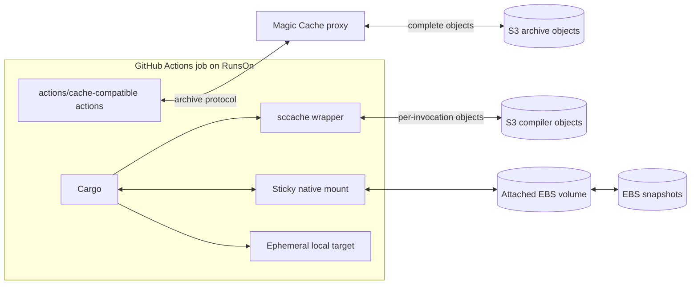

# RunsOn Cache And Disk Details

This page preserves the detailed ownership, data-flow, lifecycle, and isolation notes behind the [RunsOn deployment map](../deployments/runs-on/README.md). The behavior was checked on August 20, 2026 and must be revalidated before operational changes.

## State Ownership

| Mechanism | Persistent state | Data movement | `target/` at job start | Primary invalidation unit | Writer model |
| --- | --- | --- | --- | --- | --- |
| Magic Cache with input-only `rust-cache` | Cargo registry and Git inputs; optional mise tool state | Restore and save compressed archives through the cache protocol | Clean | Complete archive key | Prefer one trusted default-branch writer |
| Magic Cache with whole-target cache | Cargo inputs and a cleaned or complete target tree | Restore, extract, clean, recompress, and upload the complete selected archive | Restored archive | Complete archive key and fallback lineage | One trusted writer; exact source/build lineage |
| Direct S3 `sccache` | Independently keyed eligible compiler outputs | Per-compiler-call object lookup, materialization, and optional write | Clean | One compiler invocation | Trusted writers enforced by IAM |
| Sticky built-in `rust` mode | Cargo registry and Git directories on a native disk | Restore and commit EBS-backed disk snapshots | Clean | Disk lineage | Last completed clean snapshot in the lineage |
| Sticky custom target | Native Cargo inputs and target filesystem | Restore and commit EBS-backed disk snapshots | Native persistent target | Disk lineage and Cargo freshness | Partition or serialize writers |
| Local archived EBS snapshot action | Explicit mounted filesystem subtree, potentially including workspace, Cargo home, target, and helper caches | Create, attach, mount, unmount, detach, and snapshot an EBS volume | Native persistent target | Workflow-defined snapshot key/lineage | Workflow-owned lifecycle and save policy |

Keep each path under one owner. In particular, do not let `rust-cache` clean a target or Cargo-home directory that a sticky disk or filesystem snapshot is intended to preserve natively.

## Backend Boundaries



Magic Cache changes the backend for compatible archive actions. It does not change their keys, selected paths, extraction, cleanup, exact-hit behavior, or save rules. Direct `sccache` and sticky disks bypass that archive path and need separate lifecycle and trust controls.

## Lifecycle Comparison

### Magic Cache Archive

```text
compute primary and fallback keys
restore one immutable archive
download and extract all selected contents
run the workload
optional action-specific cleanup
compress all selected contents
save a new immutable object after a miss or partial restore
```

Backend lifecycle deletes complete old objects. It cannot remove stale files from the active object. More storage capacity, shorter retention, a faster S3 link, or a new key prefix does not eliminate extraction and recompression of a large current archive.

GitHub cache inventory commands are not necessarily the operational control plane for a third-party S3-backed cache object. Confirm deletion, expiration, and object size against the configured RunsOn backend rather than assuming the GitHub cache API can see or remove it.

### Direct S3 `sccache`

```text
Cargo issues compiler request
sccache computes an invocation key
hit  -> fetch and materialize matching outputs
miss -> compile locally and optionally upload outputs
Cargo continues build scripts, orchestration, unsupported outputs, and linking
```

Old objects consume storage until lifecycle expiration, but a job does not reconstruct every old object into one target tree. The residual floor is Cargo orchestration, non-cacheable calls, linking, and many individual object operations.

### Sticky Disk

```text
select newest clean snapshot in the disk lineage
create and attach an EBS volume
mount configured paths
run directly on the native filesystem
unmount cleanly
record the resulting snapshot as the newest lineage state
```

No tar archive is created or extracted. Native persistence removes archive serialization but transfers cleanup responsibility to the disk owner.

### Archived Local Snapshot Action

The archived local action follows a similar volume lifecycle but exposes snapshot identity, save policy, retention, mount layout, and credential scrubbing directly to the workflow. It offers more explicit control at the cost of broader EC2/EBS permissions and custom maintenance.

## Sticky-Disk Lineage And Fallback

The released RunsOn sticky-disk design derives a lineage from repository identity, the explicit sticky cache name, Git ref, operating system, and architecture.

- A branch first restores its newest clean snapshot.
- If the branch has no usable snapshot, it can fall back to the repository default branch.
- A pull-request job can consume default-branch state without writing into the default-branch lineage.
- Concurrent jobs start from independent volumes based on the chosen snapshot.
- The latest job whose post step records a clean unmount becomes the newest state for that lineage.
- A failed or cancelled job can still advance the lineage if its post step reaches the clean-unmount record.
- Inactive lineages expire after the configured service interval; the documented default is 10 days.

For a mutable target, use concurrency controls or separate lineages for workloads with different profiles, features, targets, or trust levels. Test cancellation and failure paths instead of assuming only successful builds can update persistent state.

## Sticky-Disk Capacity And Reset

Non-BuildKit sticky modes do not provide selective Cargo-aware garbage collection.

The released action reports low-capacity warnings when:

- Free disk space falls below 20%.
- Free inodes fall below 10%.

At action start, if either free space or free inodes is below 5%, the action attempts a reset before cache-hit detection. It warns and skips that automatic reset when mount or mode state indicates the cache is already in use.

Treat those thresholds as last-resort platform behavior, not the experiment's operating target. Record bytes, file count, free space, and free inodes; set an earlier project-specific reset threshold; and test a manual lineage reset before adoption.

Declaring a sticky disk makes persistent storage part of the job contract. A missing ready marker, unavailable disk, or `sticky_wait_timeout` expiry fails the setup step unless the workflow deliberately handles the failure. Set `sticky_wait_timeout: 15m` explicitly while the documentation and released action metadata disagree on the default.

## Magic Cache Isolation

RunsOn v3.2 documents optional repository and branch isolation for the Magic Cache protocol. It is disabled by default for backward compatibility.

When enabled:

- New protocol cache objects use the scoped namespace.
- Existing unscoped objects become cold and expire according to normal backend lifecycle.
- Workflows that intentionally share cache objects across repositories or branches must be reviewed.

This isolates cache-protocol credentials, not arbitrary direct S3 clients. It does not protect a direct `sccache` bucket or prefix from workflow code that inherits broader runner-role permissions.

## Trust Boundaries

| Data path | Workflow setting | Infrastructure control still required |
| --- | --- | --- |
| Magic Cache archive | Cache key, branch save condition, optional protocol isolation | Separate stack/role for genuinely untrusted code; backend lifecycle and encryption |
| Direct S3 `sccache` | Repository-specific prefix and optional `SCCACHE_S3_RW_MODE=READ_ONLY` | IAM-enforced read-only readers and trusted writers; dedicated bucket or prefix policy where appropriate |
| Sticky disk | Separate lineage names and workflow concurrency | Runner/repository trust boundary, encrypted EBS, snapshot permissions, and retention |
| Archived EBS snapshot | Workflow save policy and credential scrub step | Least-privilege EC2/EBS role, encryption, retention, and deletion controls |

Never persist Cargo registry credentials, cloud credentials, or tokens in a save-capable archive or disk. If Cargo home is persistent, scrub `credentials`, `credentials.toml`, and any generated config containing secrets before the post step.

## Performance Cost Shape

| Mechanism | Dominant warm-path risks |
| --- | --- |
| Input-only archive | Fixed cache setup can approach the dependency-download time it avoids |
| Whole-target archive | Complete-tree extraction, metadata writes, cleanup, compression, and immutable-object growth |
| Direct S3 `sccache` | Cargo orchestration, many small object operations, non-cacheable calls, and linking |
| Sticky Cargo inputs | Snapshot restore/commit, wait time, and EBS cost |
| Sticky target | Snapshot restore/commit, native target growth, inode pressure, source-mtime mismatches, and last-writer behavior |
| Archived EBS snapshot | Attach/mount/snapshot lifecycle, custom cleanup, permissions, and snapshot storage |

The measured archive incident was dominated by local extraction and compression rather than S3 transfer. A separate controlled compiler-cache test comparing c8a with m8idn was instead sensitive to CPU/compiler throughput and per-object orchestration; m8idn was slower for every tested strategy. This distinct CPU-family comparison says nothing about relative CPU performance among the same-processor c8a, m8a, and r8a families. See [Target Archive Growth In Production](../evidence/target-archive-growth.md) and [Cache Strategy Benchmarks](../evidence/cache-strategy-benchmarks.md).

## Official References

- [RunsOn action](https://github.com/runs-on/action)
- [RunsOn sticky disks](https://runs-on.com/docs/runners/capabilities/sticky-disks/)
- [RunsOn Magic Cache](https://runs-on.com/docs/performance/caching/actions/)
- [`sccache` S3 backend](https://github.com/mozilla/sccache/blob/main/docs/S3.md)
- [`sccache` Rust support](https://github.com/mozilla/sccache/blob/main/docs/Rust.md)
