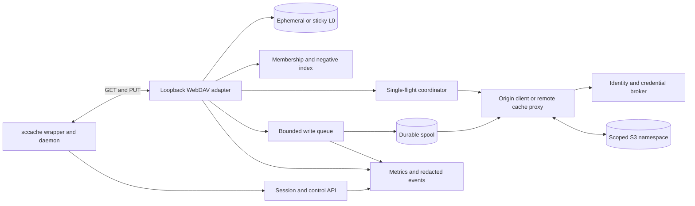

# Proposed RunsOn compiler-cache gateway

Status: Proposed and untested integration work. This page specifies requirements; it does not describe a released RunsOn feature. Use [the research index](README.md) for scope, sequencing, and the [version refresh](../../reference/compiler-cache-implementation.md#release-refresh-2026-09-06).

## Why A Gateway

The current direct path sends per-object requests through the daemon's shared remote-storage client and gives the workflow's runner role broad cache authority. A RunsOn-managed gateway can centralize performance and lifecycle work that is difficult to coordinate through workflow environment variables:

- Answer known misses without an origin request.
- Keep hot objects close to the compiler.
- Coalesce concurrent requests for the same key.
- Bound origin concurrency independently from rustc concurrency.
- Track every accepted write.
- Apply checksums and conditional-create semantics.
- Hold a durable spool and replay it after transient origin failures.
- Expose one drain operation.
- Emit per-job transport metrics.
- Obtain narrowly scoped credentials from a remote broker.

The gateway does not make same-host credentials secret from root-capable workflow code. Its security value comes from narrowing the capability that exists for that job, keeping policy enforcement remote, and avoiding broad instance-profile access.

## Protocol Options

| Job-to-gateway protocol                                  | Advantages                                                                            | Disadvantages                                                                                                   | Disposition                                         |
| -------------------------------------------------------- | ------------------------------------------------------------------------------------- | --------------------------------------------------------------------------------------------------------------- | --------------------------------------------------- |
| WebDAV using `SCCACHE_WEBDAV_ENDPOINT`                   | Supported by released `sccache`; simple GET/PUT-style prototype; bearer token support | Does not naturally expose S3 conditional-write or checksum semantics; needs a control API beside WebDAV         | Recommended first prototype                         |
| Loopback S3-compatible endpoint using `SCCACHE_ENDPOINT` | Preserves S3 client behavior and can emulate conditional writes                       | Requires request signing or a local no-credential mode, S3 compatibility surface, and careful endpoint handling | Candidate second prototype                          |
| New upstream RunsOn backend in `sccache`                 | Clean lifecycle, typed control messages, direct drain and telemetry integration       | Largest upstream change and release lead time                                                                   | Preferred long-term interface if the prototype wins |
| Native GHA protocol                                      | Reuses brokered cache path                                                            | Separate protocol risks and current finalization defect                                                         | Not the gateway foundation                          |

The prototype should use WebDAV for compiler-object transport and a separate authenticated control API for session, readiness, drain, and statistics. It should not extend WebDAV semantics ad hoc when a control operation is not an object read or write.

## Component Model



The implementation can combine these boxes in one process initially, but their contracts should remain distinct so storage, authorization, and queueing can evolve independently.

## Session Establishment

Use the [writer admission contract](trust-and-publication.md#writer-session-admission) for OIDC claims, nonce/replay checks, platform attestation, and authorization. The gateway relays the admission exchange over an authenticated channel and receives a scoped remote-proxy capability or STS session. The action receives a one-job loopback bearer token or socket capability.

Record only the non-secret session digest, policy, expiry, and fencing metadata. Refresh before expiry only while the broker confirms that the run and lease are active. Expiry stops new origin operations and uses the [safe fallback boundary](action-lifecycle.md#fallback-semantics). Loopback credentials do not isolate the gateway from root-capable job code.

## Read Path

For a compiler-object key:

1. Validate method, key syntax, namespace schema, session, and maximum response size.
2. Check the local L0.
3. Check a generation-bound membership index and bounded negative cache.
4. If a sealed immutable generation's validated complete index proves the key absent, return a normal not-found immediately; otherwise treat negative metadata as advisory and continue to origin.
5. Join an existing single-flight request for the same namespace generation and key, or become its leader.
6. Apply circuit-breaker state before contacting origin.
7. Fetch with separate connect, first-byte, idle, and total deadlines.
8. Classify not-found, auth, throttle, timeout, corruption, and backend failures separately.
9. Verify stored-byte checksum and declared length.
10. Stream or spill the object through validation rather than requiring an unbounded in-memory buffer.
11. Populate L0 atomically.
12. Return the object to `sccache`.
13. Update membership and negative state without permitting stale metadata to create false negatives.

The gateway should return not-found only for a confirmed absence or an explicitly configured fast-degrade path. It should not silently relabel authorization, KMS, corruption, or persistent backend failure as a normal miss in its telemetry.

An object read from a private overlay, untrusted sticky lineage, or other lower-trust tier may satisfy only that same or a lower-trust consumer. It must never backfill, update membership for, or otherwise flow into canonical storage.

## Request Coalescing

Concurrent rustc invocations can request identical dependency objects. The gateway should maintain a bounded single-flight map keyed by:

```text
session trust domain
namespace generation
compiler object key
representation or compression schema
```

Followers wait on the leader's result up to their own deadline. The coordinator must:

- Remove entries on success, error, cancellation, and timeout.
- Limit followers per key and total in-flight keys.
- Avoid sharing results across incompatible trust domains or namespace generations.
- Report origin fan-out avoided, follower wait, leader latency, and cancellation.
- Never let one oversized or stalled key block unrelated keys.

## Negative Caching

Negative entries should be:

- Bound to namespace generation and trust domain.
- Short lived.
- Size bounded with explicit eviction.
- Invalidated when the local job successfully writes the key.
- Authoritative only when derived from a validated complete index for a sealed immutable generation; otherwise supplemental and advisory.

A negative cache is especially valuable for repeated invocations within one job, but an excessive TTL can hide an object concurrently published by a trusted writer.

## Write Acknowledgement Modes

| Mode                                 | Acknowledgement point                                                                                             | Durability                                             | Intended use                                                             |
| ------------------------------------ | ----------------------------------------------------------------------------------------------------------------- | ------------------------------------------------------ | ------------------------------------------------------------------------ |
| `COMMITTED` remote commit            | Conditional origin write and required integrity verification complete                                             | Strongest                                              | Initial canonical population writer                                      |
| `DEFERRED` remote replay admission   | A remotely owned durable replay system accepts a broker-authorized record and returns its durable record identity | Depends on the explicitly stated replay failure domain | Future controlled optimization; never readiness-eligible until committed |
| Memory or ephemeral local acceptance | Bytes accepted only by the current process or runner                                                              | Lost on crash or teardown                              | Never describe as canonical committed                                    |
| Best effort detached                 | Background task spawned                                                                                           | Untracked                                              | Not acceptable for promoted writes                                       |

Terminal outcomes are distinct:

- `COMMITTED`: the origin conditional write and required verification completed; this is the only initial success response to `sccache`.
- `DEFERRED`: an explicitly qualified remote replay service accepted durable responsibility; the object is not yet readable or readiness-eligible.
- `REJECTED`: no write responsibility was accepted, including policy rejection and queue admission failure.
- `FAILED`: a terminal attempted write failure is known.
- `UNFINISHED`: completion cannot be established and no committed or deferred success was issued.

For the initial canonical writer, acknowledge success only after remote commit. This can preserve population overhead, but it establishes correct accounting before introducing asynchronous optimization.

A same-host root-writable spool cannot authorize later canonical replay: root-capable job code can forge or modify both bytes and local metadata. A later deferred mode is valid only when a remote admission service, or a broker-signed immutable envelope accepted by that service, binds the key, stored-byte digest, tenant, namespace generation, trusted writer run, expiry, fencing epoch, and policy decision before the job loses authority.

A later replay mode must also:

- State the exact failures its durability promise survives.
- Encrypt payloads and metadata and never persist raw job STS credentials.
- Use framed, checksummed, ordered WAL records with partial-record recovery and compaction.
- Revalidate lease, generation, quarantine, revocation, expiry, and fencing before replay.
- Use bounded per-tenant quotas, fair scheduling, and at-least-once replay with idempotent conditional creation.
- Isolate poison records, expose dead-letter handling, and provide audited operator inspection.
- Report committed, deferred-to-replay, rejected, failed, and unfinished separately.

An ephemeral EBS volume that disappears with the runner is not durable merely because writes were fsynced.

## Write Queue And Backpressure

The queue needs explicit limits for:

- Requests.
- Compressed bytes.
- Decoded bytes.
- Per-object size.
- Per-job and per-repository bytes.
- Concurrent origin writes.
- Retry attempts and retry time.
- Spool disk bytes and free inodes.
- Drain deadline.

When admission is full, choose one visible policy:

- Block the cache write up to a short deadline.
- Reject the cache write while allowing compilation to succeed.
- Switch a private overlay to local-only.
- Fail a strict population job.

Never accept an unbounded queue or silently discard a supposedly committed canonical write.

## Membership index

Choose a representation against object cardinality, memory, build/download cost, and the [sealed-generation membership rule](trust-and-publication.md#membership-and-negative-index):

| Design                       | Advantages                                         | Risks and controls                                                                                        |
| ---------------------------- | -------------------------------------------------- | --------------------------------------------------------------------------------------------------------- |
| Sharded Bloom filter         | Compact, no false negatives if generated correctly | False positives still reach S3; rebuild and generation ordering required                                  |
| Sharded Xor filter           | Compact and fast lookup                            | Immutable generation rebuilds; more complex producer                                                      |
| Sorted manifest shards       | Exact membership and simple integrity              | Larger downloads and binary-search implementation                                                         |
| DynamoDB index               | Low-latency mutable membership candidate           | S3 and index writes are not one transaction; negative answers are advisory until the generation is sealed |
| Redis or Valkey index        | Fast mutable membership                            | Eviction and durability can create false negatives unless treated carefully                               |
| Bounded local negative cache | Simple and useful during one job                   | Supplemental only; short TTL and namespace generation key required                                        |

One illustrative layout is `index/v1/<generation>/metadata.json`, immutable `shard-0000` files, and an `index/v1/current` pointer. Follow the [single publication sequence](trust-and-publication.md#readiness-manifest). Readers validate metadata and shards before use; invalid or unavailable indexes fall back to bounded origin lookups instead of suppressing hits.

## Control API

The prototype should expose a small versioned local API:

| Operation       | Purpose                                                                                                                   |
| --------------- | ------------------------------------------------------------------------------------------------------------------------- |
| `CreateSession` | Bind verified identity, namespace, access mode, limits, and expiration                                                    |
| `Health`        | Confirm process, origin circuit, local capacity, and session state                                                        |
| `Readiness`     | Return absent, populating, ready, degraded, or rotated                                                                    |
| `Stats`         | Return redacted counters and latency histograms                                                                           |
| `BeginQuiesce`  | Seal new compiler-producer admission while allowing requests from already admitted producers                              |
| `BeginDrain`    | After active producers reach zero, disable backfills, capture the watermark, and stop new write admission                 |
| `DrainStatus`   | Atomically return state, watermark, active producers, queue, committed, rejected, failed, deferred, and unfinished counts |
| `CloseSession`  | Revoke the loopback or remote-proxy capability, stop refresh, remove local credential references, and close telemetry     |

The API must be idempotent where retries are expected. `CloseSession` must not imply successful drain unless drain status proves it. Direct AWS STS credentials normally remain valid until expiration; closing a local session is not ordinary per-session STS revocation, and in-memory zeroization is best effort.

## Drain integration

Implement the [action lifecycle's post transaction](action-lifecycle.md#post-transaction): `OPEN -> QUIESCING -> DRAINING -> CLOSED`. The control API exposes those transitions and terminal counts; it does not define a second shutdown contract. Missing-post and stale-writer behavior follows [publication authority](trust-and-publication.md#readiness-manifest).

## Gateway failure policy

Use the [shared failure matrix](validation.md#failure-and-fallback-matrix) for ordinary-reader and population outcomes. A strict population must fail without publishing when queue admission, drain, integrity, or authority requirements fail. Cache failures must respect the [one-compiler fallback rule](action-lifecycle.md#fallback-semantics).

## Gateway Deployment Shapes

| Shape                                  | Performance                                   | Isolation                                        | Operational cost | Use                                                           |
| -------------------------------------- | --------------------------------------------- | ------------------------------------------------ | ---------------- | ------------------------------------------------------------- |
| Process in runner agent namespace      | Lowest loopback latency                       | No security boundary from root workflow code     | Low              | First prototype                                               |
| Per-runner sidecar or system service   | Similar latency and clearer lifecycle         | Still same-host against root                     | Medium           | Mature local gateway                                          |
| Per-AZ remote proxy                    | Additional network hop, still near runner     | Better credential and policy isolation           | Medium to high   | Strong origin broker/proxy                                    |
| Hybrid local gateway with remote proxy | Local coalescing and L0 with remote authority | Best separation of performance and authorization | Highest          | Target production architecture if measured value justifies it |

The first prototype should be a local process with read-only origin access. Canonical write support should follow only after the queue, drain, integrity, and remote-policy contracts are tested.
